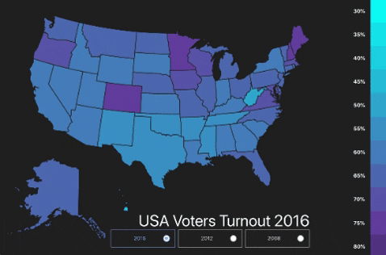

This project uses resources from a public API (http://www.electproject.org), focusing on the U.S. voter turnout for the past three presidential elections. The goal of the representation was to compare the number of actual voters against the voting-eligible population (VEP) per state. A scale of colors from light blue to purple symbolized the percentage of voters per state, numbers averaging from 10% to 80%. In addition, it displays a tooltip with the exact voter turnout percentage when hovering on any state. The visuals were developed using ReactJS and the npm package react-svg-map. Future development will add a selection option that would allow the comparison of several state’s demographic information. This addition would help viewers identify different patterns such as similarities and differences in states with a similar voting turnout.

## Available Scripts

In the project directory, you can run:

### `npm start`

Runs the app in the development mode. 
Open [http://localhost:3000](http://localhost:3000) to view it in the browser.

The page will reload if you make edits. 
You will also see any lint errors in the console.
